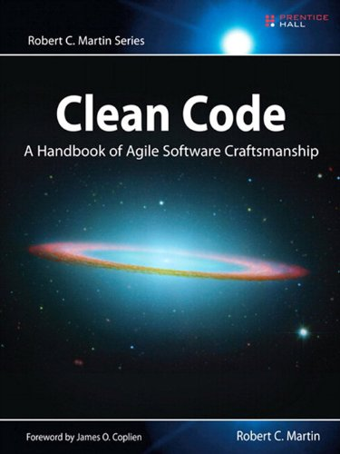
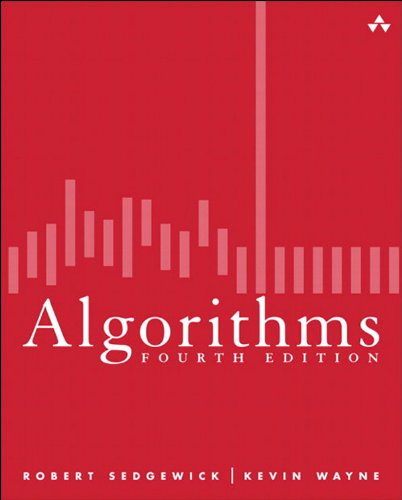
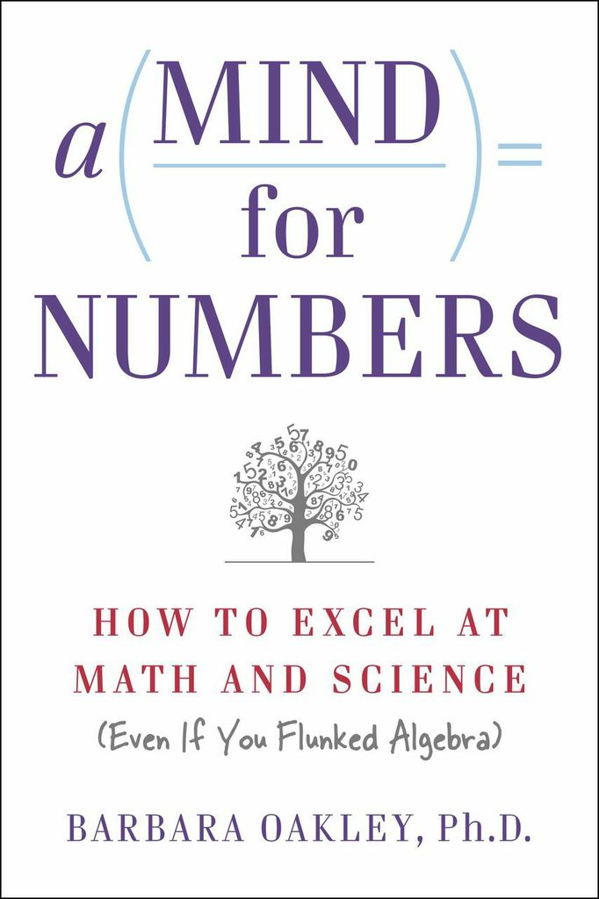
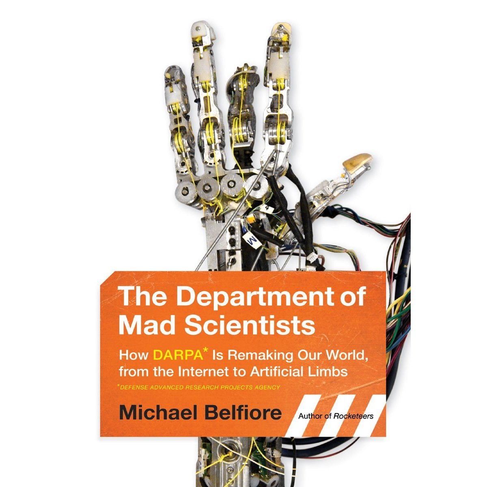

Title: Books

<h2>Favourite or Interesting Books</h2>

<table>
	<thead>
		<tr>
			<th style="width: 20%;" colspan="2"><h3>Programming</h3></th>
		</tr>
	</thead>
	<tbody>

		<tr>
			<td colspan="2" style="vertical-align:top">
				
			</td>
			<td style="padding: 5px;">
				<strong><a href="http://www.amazon.ca/Clean-Code-Handbook-Software-Craftsmanship/dp/0132350882/ref=sr_1_1?ie=UTF8&amp;s=books&amp;qid=1283557358&amp;sr=8-1" title="Clean Code" target="_blank">Clean Code</a></strong> is one of a small selection of books that really seems to have captured the ideas needed to keep code from being designed and developed poorly. It will help you both detect and prevent code rot.

				Bob Martin has been around long enough, along with people like Martin Fowler to have the experience needed to write a book like this. It’s one of those core books that every developer should read, and re-read.
			</td>
		</tr>

		<tr>
			<td colspan="2" style="vertical-align:top">
				
			</td>
			<td>
				<strong><a href="http://www.amazon.ca/Algorithms-4th-Edition-ebook/dp/B004P8J1NA/ref=tmm_kin_title_0?ie=UTF8&qid=1362460204&sr=8-2" title="Algorithms, 4th Edition" target="_blank">Algorithms</a></strong> by Robert Sedgewick & Kevin Wayne is a great practical book on algorithms. By this I mean, it presents the material not from a theoretical or analysis point of view, but as here is what you need to know to get this working. Sedgewick has other books covering analysis of algorithms. If you couple this book with the website that includes a vast amount of the book online, and even better, the Algorithms course on <a href="http://www.coursera.org" target="_blank">Coursera</a> that Sedgewick provides, you are going to immerse yourself in this topic, and come away with deep, practical knowledge.
			</td>
		</tr>

		<tr>
			<td colspan="2" style="vertical-align:top">
				
			</td>
			<td>
				Based heavily on real-world experiences, <strong><a href="http://www.amazon.ca/Algorithm-Design-Manual-Steven-Skiena/dp/1849967202/ref=sr_1_2?ie=UTF8&qid=1362461643&sr=8-2" title="Algorithm Design Manual, 2nd ed" target="_blank">Algorithm Design Manual, 2nd ed</a></strong> covers the design and analysis of algorithms, and a section on what the author believes are the 75 most important algorithmic problems.
			</td>
		</tr>
	</tbody>
</table>

    <table>
        <thead>
            <tr>
                <th style="width: 20%; colspan="2>
<h3>Learning</h3>
</th>
            </tr>
        </thead>
        <tbody>
            <tr>
                <td colspan="2" style="vertical-align:top">
                    
                </td>
                <td style="padding: 5px;">
                    <strong><a href="http://www.amazon.ca/Mind-Numbers-Science-Flunked-Algebra-ebook/dp/B00G3L19ZU/ref=sr_1_1?ie=UTF8&qid=1408820978&sr=8-1&keywords=mind+for+numbers" title="A Mind for Numbers" target="_blank">A Mind for Numbers</a></strong> is an <strong>excellent</strong> book on the latest that is known on how to learn (and how not to). Well written, well thought-out, with clear examples. I highly recommend this to anyone looking to improve their learning. There is also an online course available thorugh <a href="https://class.coursera.org/learning-001/">Coursera</a> that covers the material in the book.
                </td>
            </tr>
        </tbody>
    </table>

<table>
	<thead>
		<tr>
			<th style="width: 20%;" colspan="2">
<h3>Technology</h3>
</th>
		</tr>
	</thead>
	<tbody>
		<tr>
			<td colspan="2" style="vertical-align:top">
				

			</td>
			<td>
				In the <strong><a href="http://www.amazon.ca/Department-Mad-Scientists-Michael-Belfiore/dp/0061577936/ref=sr_1_1?ie=UTF8&amp;s=books&amp;qid=1267302226&amp;sr=8-1" title="Department of Mad Scientists" target="_blank">Department of Mad Scientists</a></strong>, the author take you through a fascinating look at DARPA - The Defense Advanced Research Projects Agency. You may not have heard of DARPA, but among other things, they funded and helped develop something that today is called the Internet… If you have an interest in how big (outlandish) ideas get turned into reality when no one else in the world even thinks it’s possible, read this book :-).
			</td>
		</tr>
	</tbody>
</table>

<table>
	<thead>
		<tr>
			<th style="width: 20%;" colspan="2">
<h3>Fiction</h3>
</th>
		</tr>
	</thead>
	<tbody>
		<tr>
			<td colspan="2" style="vertical-align:top">
				
			</td>
			<td>
				When <strong><a href="http://www.amazon.ca/Daemon-Daniel-Suarez/dp/0451228731/ref=sr_1_1?ie=UTF8&amp;s=books&amp;qid=1283557602&amp;sr=1-1" title="Daemon" target="_blank">Daemon</a></strong> came out, it quickly became one of my favourite books of all time. It’s up there with Cryptonomicon and Neuromancer. I won’t give any spoilers, but if you liked Cryptonomicon, you’ll probably like this. The author is a techie who has worked in the industry, with some of the larger companies. He has a good grasp on current and near-future tech.
			</td>
		</tr>
	</tbody>
</table>
